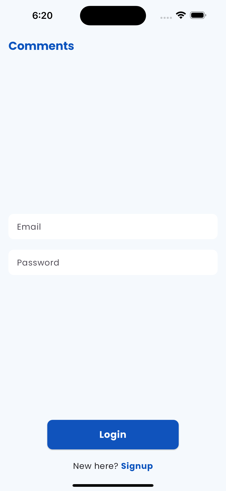
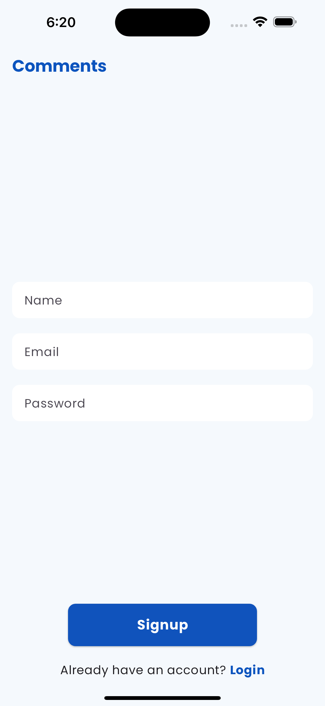
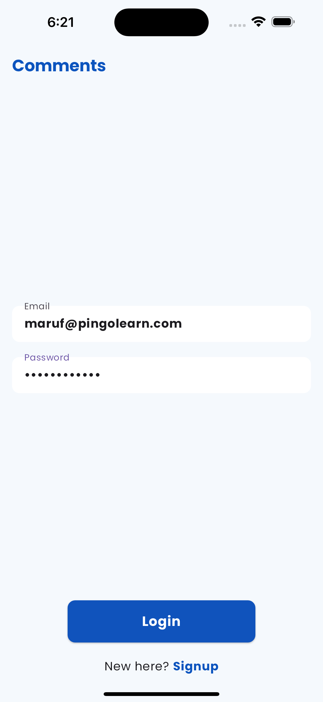
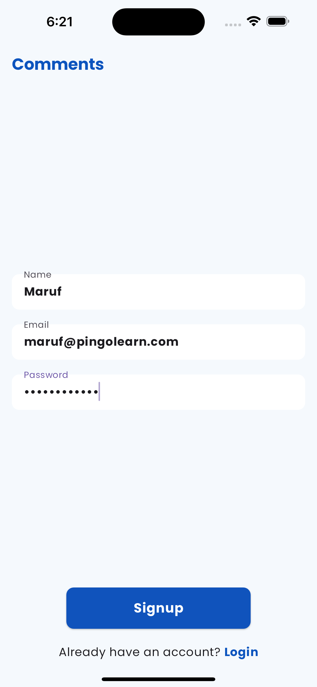
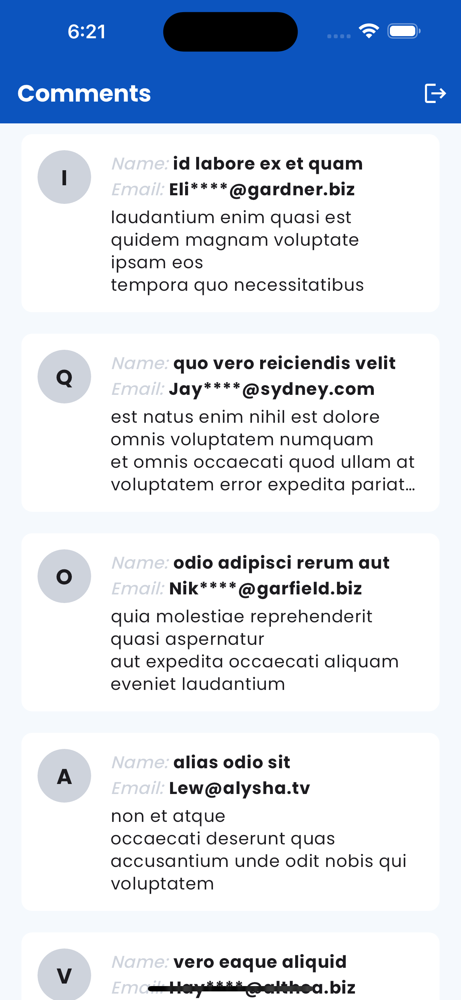

# Comment-App

App made using Flutter for PingoLearn.

#### The email used during Signup & Login are purely coincidental. It has not been used to foreshadow the future. I promise I am not a time traveller 😉

## App Showcase

## Screenshots

<table>
  <tr>
    <td>
Login Screen without data
</td>
    <td>
Signup Screen without data
</td>
  </tr>
  <tr>
    

    <td></td>
    <td></td>
  </tr>
  <tr>
    <td>
Login Screen with data
</td>
    <td>
Signup Screen with data
</td>
  </tr>
  <tr>
    <td></td>
    <td></td>
  </tr>
  <tr>
    <td>
Home Screen
</td>
  </tr>
  <tr>
    <td></td>
  </tr>
 </table>
